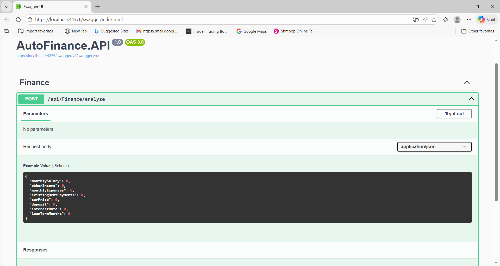

# AutoFinance AI 🚗💰

## Portfolio Showcase

**AutoFinance AI** is a full-stack car finance application built to demonstrate **backend financial logic, API development, and frontend integration**.  
It calculates car loan affordability, predicts approval likelihood, evaluates risk, and suggests safer car prices for users.  

This project showcases:  
- Full-stack development skills (C# ASP.NET Core + React/Angular/Blazor)  
- Clean layered architecture (**Models → Services → Controllers**)  
- Professional API design with **Swagger UI**  
- Practical financial algorithms with real-world applicability  

**This repo is designed as a portfolio piece to demonstrate coding skills, architectural understanding, and front-to-back project delivery.**

# AutoFinance AI

## Overview
AutoFinance AI is a full-stack car finance project that calculates car loan affordability, risk scoring, and suggests a safer car price for users. The project demonstrates backend financial logic, API development, and frontend integration.

---

## Project Structure

- `AutoFinance.API/` → Backend (ASP.NET Core Web API)  
- `AutoFinanceAPI-Frontend/` → Frontend (React / Angular / Blazor)  

---

## Features

- Calculates monthly loan installments  
- Calculates Debt-to-Income ratio  
- Provides risk level and approval probability  
- Suggests safer car price if DTI is too high  
- Clean layered architecture: Models → Services → Controllers  
- Swagger UI ready for API testing  

---

## Tech Stack

- Backend: ASP.NET Core Web API  
- Frontend: React / Angular / Blazor  
- Language: C#  
- Tools: Visual Studio, Node.js, npm  

---

## How to Run

### Backend
bash
cd AutoFinance.API
dotnet run
Backend runs at https://localhost:44376/swagger/index.html

### Frontend
powershell
cd autofinanceapi-frontend
npm start
Frontend runs at http://localhost:3000

## Screenshots

**Backend — Swagger UI:**  

**Frontend:**  

